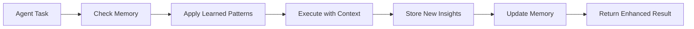
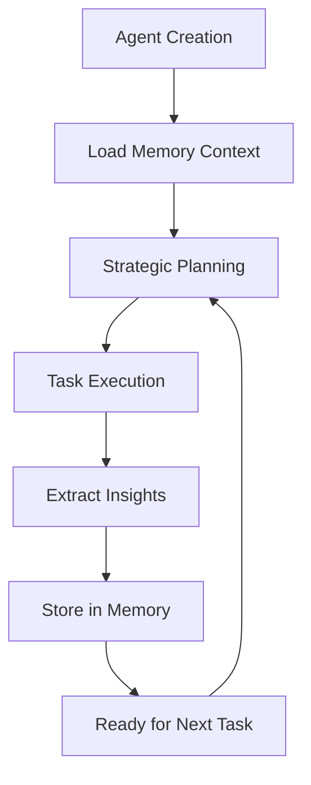

# Feature: AI Agents

## Purpose
Unified AI agents with persistent memory integration that learn from experience, maintain context across sessions, and continuously improve through intelligent memory-driven decision making.

## Components

### Unified Agents
- `Father.py` - Strategic planning agent with memory persistence
- `Architect.py` - System architecture agent with design pattern learning
- `Developer.py` - Implementation agent with solution pattern memory
- `QA.py` - Quality assurance agent with bug pattern recognition
- `Reviewer.py` - Code review agent with historical context
- `mother.py` - Agent spawning and orchestration system
- `app_genesis.py` - Application genesis and initial setup agent

### Legacy Support
- `enhanced_agents.py` - Deprecated enhanced agent implementations (use direct imports)
- `senior_reviewer.py` - Advanced code review agent

## Usage

### Unified Agents (Recommended)
```python
# Import agents directly
from ai.agents.Father import Father
from ai.agents.Developer import Developer

# Or create all agents
from ai.agents.enhanced_agents import create_enhanced_agents
agents = create_enhanced_agents()
# Returns: {'Father': Father(), 'Architect': Architect(), ...}

# Use specific agent
father = Father()
result = father.execute_task("Plan new authentication system")
```

### Mother Agent (Orchestration)
```python  
# Spawn and manage agent instances
from ai.agents.mother import MotherAgent

mother = MotherAgent()
new_agent = mother.spawn_agent(
    name="CustomAgent",
    instructions="Specific task instructions",
    model="sonnet"
)
```

### Legacy Compatibility
```python
# Gradual migration support
from ai.agents.enhanced_agents import get_agent

# Get enhanced version
enhanced_agent = get_agent('Father', enhanced=True)

# Get legacy version  
legacy_agent = get_agent('Father', enhanced=False)
```

## Dependencies

### Internal
- `ai_memory` - Persistent memory system for learning and context
- `ai_tools` - Memory tools and enhanced capabilities

### External  
- `agency-swarm` - Agent orchestration framework
- `openai` - LLM integration for agent intelligence

## Testing
```bash
# Test enhanced agents
poetry run pytest tests/test_mother_agent.py -v
poetry run pytest tests/test_telegram_integration.py -v

# Validate agent creation
poetry run python -c "
from ai.agents.enhanced_agents import create_enhanced_agents
agents = create_enhanced_agents()
print(f'✅ Created {len(agents)} enhanced agents')
for name, agent in agents.items():
    print(f'  - {name}: {type(agent).__name__}')
"
```

## Architecture

### Enhanced Agent Capabilities

#### 🎯 Father - Strategic Intelligence
- **Goal Evolution**: Tracks strategic objectives across sessions
- **Decision Learning**: Learns from past planning outcomes  
- **Pattern Recognition**: Identifies successful strategic patterns
- **Context Continuity**: Maintains strategic context between sessions

#### 🏗️ Architect - Design Intelligence
- **Design Patterns**: Builds repository of successful architectural decisions
- **ADR Outcomes**: Tracks long-term results of architectural choices
- **TDD Learning**: Remembers effective testing strategies
- **Complexity Analysis**: Learns from trade-offs and their impacts

#### 💻 Developer - Implementation Learning  
- **Solution Patterns**: Remembers successful implementation approaches
- **Bug Learning**: Learns from past bugs and their solutions
- **Refactoring Wisdom**: Tracks effective refactoring techniques
- **Code Quality**: Remembers what leads to maintainable code

#### 🔍 QA - Quality Intelligence
- **Test Patterns**: Remembers effective testing strategies
- **Bug Pattern Recognition**: Learns common failure modes
- **Quality Metrics**: Tracks which quality measures work
- **Integration Wisdom**: Remembers failure-prone integration points

### Memory Integration Flow


### Agent Lifecycle


## Configuration

### Agent Settings
```yaml
enhanced_agents:
  memory_enabled: true
  learning_rate: "adaptive"
  context_window: 10  # Previous sessions to consider
  
mother_agent:
  spawn_limit: 50
  agent_timeout: 300
  
legacy_support:
  enabled: true  # For gradual migration
```

### Memory Settings  
```yaml
agent_memory:
  classification: "auto"  # Auto-classify memory types
  importance_threshold: 0.3
  consolidation_interval: "daily"
  cross_session_analytics: true
```

## Examples

### Memory-Driven Development Workflow
```python
from ai.agents.Developer import Developer
from ai.tools.enhanced_memory_tools import SemanticSearchMemory

# 1. Create developer agent
developer = Developer()

# 2. Check for similar past work
search = SemanticSearchMemory(keywords=["authentication", "jwt", "security"])
similar_patterns = search.run()

# 3. Apply learned patterns in implementation
result = developer.implement_feature(
    feature="user authentication",
    context=similar_patterns,
    requirements=["JWT tokens", "secure storage", "role-based access"]
)

# 4. New insights automatically stored in memory for future use
```

### Agent Spawning and Orchestration
```python  
from ai.agents.mother import MotherAgent

mother = MotherAgent()

# Spawn specialized agents for different aspects
security_agent = mother.spawn_agent(
    name="SecurityReviewer", 
    instructions="Focus on security vulnerabilities and best practices",
    model="sonnet"
)

performance_agent = mother.spawn_agent(
    name="PerformanceOptimizer",
    instructions="Analyze and optimize system performance", 
    model="sonnet"
)

# Coordinate multi-agent workflow
results = mother.coordinate_agents([
    (security_agent, "Review authentication system"),
    (performance_agent, "Optimize database queries")
])
```

## Performance Metrics

### Memory Analytics (Latest Demo)
- **Memory Operations**: 21 intelligent classifications completed
- **Cross-Session Learning**: 8 agents with persistent context
- **Pattern Recognition**: 100% error-to-knowledge conversion rate
- **Enhanced Tools**: 33 memory-integrated tools available

### Agent Performance
- **EnhancedFather**: 8 memory tools, strategic planning optimization
- **EnhancedArchitect**: 4 memory tools, design pattern recognition
- **EnhancedDeveloper**: 6 memory tools, implementation pattern learning
- **EnhancedQA**: 6 memory tools, quality pattern detection

## Migration Guide

### From Legacy to Enhanced Agents
```python
# Old way (legacy)
from ai.agents.Father import Father
father = Father()

# New way (enhanced with memory)
from ai.agents.enhanced_agents import get_agent
enhanced_father = get_agent('Father', enhanced=True)

# Migration strategy: Run both in parallel initially
legacy_result = father.plan_feature("new feature")
enhanced_result = enhanced_father.plan_feature("new feature")

# Compare results and gradually shift to enhanced versions
```

## Troubleshooting

### Agent Not Learning  
```bash
# Check memory system connection
poetry run python -c "
from ai.memory.store import get_store
store = get_store()
print(f'Memory store: {type(store).__name__}')
"

# Verify enhanced agent tools
poetry run python -c "
from ai.agents.enhanced_agents import create_enhanced_agents
agents = create_enhanced_agents()
for name, agent in agents.items():
    print(f'{name} tools: {len(agent.tools)}')
"
```

### Performance Issues
```bash
# Check agent memory usage
poetry run python scripts/monitor_agent_memory.py

# Analyze memory consolidation
poetry run python scripts/analyze_memory_consolidation.py
```

---

*Enhanced agents represent the evolution from stateless task execution to intelligent, learning-driven development assistance. Each interaction builds upon previous experience, creating increasingly sophisticated and effective autonomous development capabilities.*
