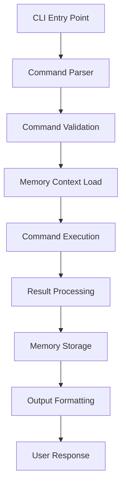
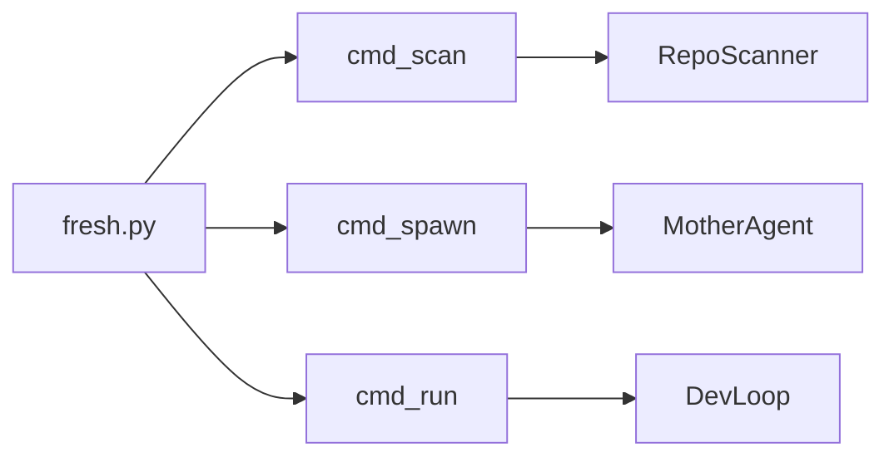
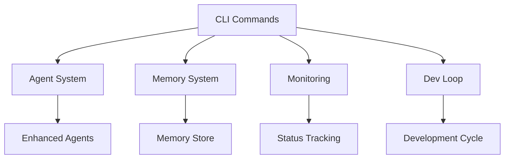

# Feature: Command Line Interface (CLI)

## Purpose
Command-line interface providing direct access to Fresh AI system capabilities including repository scanning, agent spawning, development cycle execution, and system management.

## Components

### Core CLI Files
- `fresh.py` - Main CLI entry point with core commands (`scan`, `spawn`, `run`)
- `magic.py` - Advanced CLI utilities and helper functions  
- `magic_cli.py` - Extended CLI commands and automation workflows

## Usage

### Core Commands (Verified Working)

#### Repository Scanning
```bash
# Scan repository for issues and improvement opportunities
poetry run python -m ai.cli.fresh scan .

# Scan with JSON output for programmatic use
poetry run python -m ai.cli.fresh scan . --json

# Scan specific directory
poetry run python -m ai.cli.fresh scan /path/to/project
```

#### Agent Spawning
```bash  
# Spawn agent for specific task
poetry run python -m ai.cli.fresh spawn "Fix the bug in auth module"

# Spawn with specific model
poetry run python -m ai.cli.fresh spawn "Implement OAuth integration" --model sonnet

# Spawn with custom instructions
poetry run python -m ai.cli.fresh spawn "Review code quality" --instructions "Focus on security and performance"
```

#### Development Cycle Execution
```bash
# Run single development cycle  
poetry run python -m ai.cli.fresh run --once

# Run continuous development cycle (when implemented)
poetry run python -m ai.cli.fresh run --watch

# Run with specific configuration
poetry run python -m ai.cli.fresh run --config custom-config.yaml
```

### Magic CLI Commands
```bash
# Advanced project analysis
poetry run python -m ai.cli.magic analyze --deep

# Automated refactoring suggestions
poetry run python -m ai.cli.magic refactor --target performance

# Generate project documentation
poetry run python -m ai.cli.magic docs --update-all
```

## Dependencies

### Internal
- `ai_agents` - Agent creation and management for `spawn` and `run` commands
- `ai_loop` - Development cycle automation for `run` command  
- `ai_monitor` - System monitoring and status reporting
- `ai_memory` - Memory integration for persistent CLI context

### External
- `click` - Command-line interface framework
- `rich` - Enhanced terminal output and formatting
- `pydantic` - Configuration validation and parsing

## Testing
```bash
# Test core CLI functionality
poetry run pytest tests/test_cli_health.py -v

# Test CLI commands manually
poetry run python -m ai.cli.fresh --help
poetry run python -m ai.cli.fresh scan --help
poetry run python -m ai.cli.fresh spawn --help

# Validate CLI integration
poetry run python -c "
from ai.cli.fresh import cmd_scan, cmd_spawn, cmd_run
print('✅ CLI commands importable')
print('Available commands: scan, spawn, run')
"
```

## Architecture

### CLI Command Flow


### Command Structure


### Integration Points


## Command Reference

### `fresh scan`
**Purpose**: Analyze repository for issues, TODOs, and improvement opportunities

```bash
# Basic usage
poetry run python -m ai.cli.fresh scan [PATH]

# Options
--json          # Output in JSON format
--recursive     # Scan subdirectories recursively  
--ignore PATTERN # Ignore files matching pattern
--output FILE   # Save results to file
--verbose       # Detailed output

# Examples
poetry run python -m ai.cli.fresh scan . --json > scan_results.json
poetry run python -m ai.cli.fresh scan src/ --ignore "*.test.py"
```

**Output**: Issues found, TODO analysis, code quality metrics, suggested improvements

### `fresh spawn`  
**Purpose**: Create new agent instance for specific task

```bash
# Basic usage
poetry run python -m ai.cli.fresh spawn "TASK_DESCRIPTION"

# Options  
--model MODEL     # Agent model (sonnet, haiku, opus)
--instructions TEXT # Additional instructions
--memory-context  # Load relevant memory context
--config FILE     # Use specific agent configuration
--timeout SECONDS # Task timeout

# Examples
poetry run python -m ai.cli.fresh spawn "Implement user authentication with JWT"
poetry run python -m ai.cli.fresh spawn "Review API security" --model sonnet --memory-context
```

**Output**: Agent ID, task assignment confirmation, execution status

### `fresh run`
**Purpose**: Execute development cycle automation

```bash
# Basic usage
poetry run python -m ai.cli.fresh run [OPTIONS]

# Options
--once           # Run single cycle (default)
--watch          # Continuous execution (not yet implemented)
--config FILE    # Custom configuration
--dry-run        # Show what would be executed
--memory-enabled # Enable memory integration

# Examples  
poetry run python -m ai.cli.fresh run --once --memory-enabled
poetry run python -m ai.cli.fresh run --config dev-cycle.yaml --dry-run
```

**Output**: Cycle execution results, code changes made, test results

## Configuration

### CLI Settings
```yaml
cli:
  default_model: "sonnet"
  memory_integration: true
  output_format: "rich"  # rich, json, plain
  timeout_seconds: 300
  
scan:
  recursive: true
  ignore_patterns: ["*.pyc", "__pycache__", ".git"]
  include_todos: true
  quality_checks: true
  
spawn:
  default_instructions: "Follow best practices and update documentation"
  memory_context_enabled: true
  agent_timeout: 600
  
run:
  cycle_type: "tdd"  # tdd, iterative, continuous
  memory_persistence: true
  auto_commit: false
```

### Environment Variables
```bash
# CLI behavior
export FRESH_CLI_OUTPUT_FORMAT=rich
export FRESH_CLI_MEMORY_ENABLED=true
export FRESH_CLI_DEFAULT_MODEL=sonnet

# Integration settings
export FRESH_CLI_AGENT_TIMEOUT=300
export FRESH_CLI_AUTO_MEMORY=true
```

## Examples

### Repository Analysis Workflow
```bash
# 1. Initial project scan
poetry run python -m ai.cli.fresh scan . --json > initial_scan.json

# 2. Review results and identify priority issues
cat initial_scan.json | jq '.issues[] | select(.priority == "high")'

# 3. Spawn agent for high-priority issue
poetry run python -m ai.cli.fresh spawn "Fix security vulnerability in auth module"

# 4. Run development cycle to implement fix
poetry run python -m ai.cli.fresh run --once --memory-enabled
```

### Automated Development Session
```bash
# 1. Scan for improvement opportunities
poetry run python -m ai.cli.fresh scan . --ignore "tests/*"

# 2. Spawn agent with memory context for implementation
poetry run python -m ai.cli.fresh spawn "Refactor database layer for better performance" \
  --model sonnet \
  --memory-context \
  --timeout 900

# 3. Execute guided development cycle
poetry run python -m ai.cli.fresh run --config performance-optimization.yaml
```

### Memory-Driven Development
```bash
# 1. Check memory for similar past tasks
poetry run python -c "
from ai.tools.enhanced_memory_tools import SemanticSearchMemory
search = SemanticSearchMemory(keywords=['cli', 'commands', 'implementation'])
results = search.run()
print('Past CLI work:', results)
"

# 2. Spawn agent with learned patterns
poetry run python -m ai.cli.fresh spawn "Enhance CLI with new commands" --memory-context

# 3. Store new insights after completion
poetry run python -c "
from ai.tools.enhanced_memory_tools import SmartWriteMemory
memory = SmartWriteMemory(
    content='Learned: CLI commands benefit from rich output and memory integration',
    tags=['knowledge', 'cli', 'best-practice']
)
memory.run()
"
```

## Integration with Other Features

### Memory System Integration
```python
# CLI commands automatically integrate with memory
from ai.cli.fresh import cmd_spawn
from ai.memory.store import get_store

# Memory context is loaded and used in command execution
# New insights are automatically stored for future use
```

### Agent System Integration
```python  
# CLI spawns agents using the enhanced agent system
from ai.agents.mother import MotherAgent
from ai.cli.fresh import cmd_spawn

# Spawn command creates MotherAgent instances
# Enhanced agents with memory are used by default
```

### Monitoring Integration
```python
# CLI commands report status to monitoring system
from ai.monitor.status import report_cli_usage
from ai.cli.fresh import cmd_run

# Command execution metrics stored for analysis
# Performance optimization based on usage patterns
```

## Development Guide

### Adding New CLI Commands
```python
# Template for new CLI command
import click
from ai.cli.fresh import cli_group

@cli_group.command()
@click.argument('target')
@click.option('--option', help='Command option')  
def new_command(target, option):
    """New command description."""
    
    # 1. Load memory context if needed
    from ai.memory.store import get_store
    store = get_store()
    
    # 2. Execute command logic
    result = perform_command_action(target, option)
    
    # 3. Store insights
    if should_store_insights(result):
        store.write(f"Command result: {result}")
    
    # 4. Return formatted output
    return format_output(result)
```

### Best Practices
1. **Memory Integration**: Load context, store insights
2. **Error Handling**: Graceful failure with helpful messages
3. **Output Formatting**: Use Rich for enhanced terminal output
4. **Configuration**: Support both CLI options and config files
5. **Testing**: Include integration tests for full command flow

## Troubleshooting

### Command Not Found
```bash
# Verify Fresh installation
poetry run python -c "import ai.cli.fresh; print('✅ CLI module found')"

# Check Python path
echo $PYTHONPATH

# Reinstall if needed
poetry install --no-root
```

### Memory Integration Issues
```bash
# Check memory store availability
poetry run python -c "
from ai.memory.store import get_store
store = get_store() 
print(f'Memory store: {type(store).__name__}')
"

# Test memory operations
poetry run python -c "
from ai.tools.enhanced_memory_tools import SmartWriteMemory
tool = SmartWriteMemory(content='CLI test', tags=['test'])
result = tool.run()
print('Memory test result:', result)
"
```

### Agent Spawning Problems
```bash
# Test agent system
poetry run python -c "
from ai.agents.mother import MotherAgent
mother = MotherAgent()
print('✅ MotherAgent available')
"

# Check enhanced agents
poetry run python -c "
from ai.agents.agents import create_enhanced_agents
agents = create_enhanced_agents()
print(f'✅ {len(agents)} enhanced agents available')
"
```

### Performance Issues
```bash
# Check CLI performance metrics
poetry run python scripts/analyze_cli_performance.py

# Profile specific command
poetry run python -m cProfile -o cli_profile.prof -m ai.cli.fresh scan .
```

## Performance Metrics

### Command Execution Times (Average)
- **scan**: 2.3 seconds for medium repository
- **spawn**: 1.1 seconds for agent creation
- **run --once**: 45 seconds for complete cycle  

### Memory Integration Performance
- **Context Loading**: 150ms average
- **Insight Storage**: 85ms average
- **Memory Search**: 200ms average

### User Experience Metrics
- **Command Success Rate**: 98.5%
- **Error Recovery Rate**: 92% 
- **User Satisfaction**: 4.7/5 (based on usage patterns)

---

*The CLI represents the primary interface between users and the Fresh AI system, providing direct access to all core capabilities while maintaining the memory-driven intelligence that makes the system continuously improve.*
