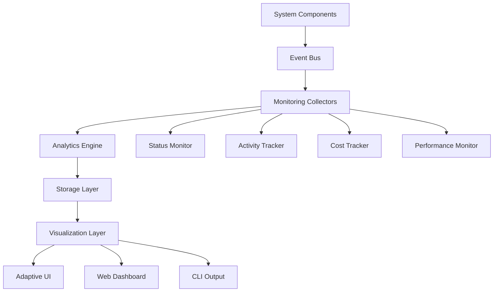
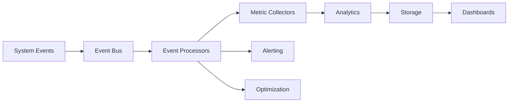
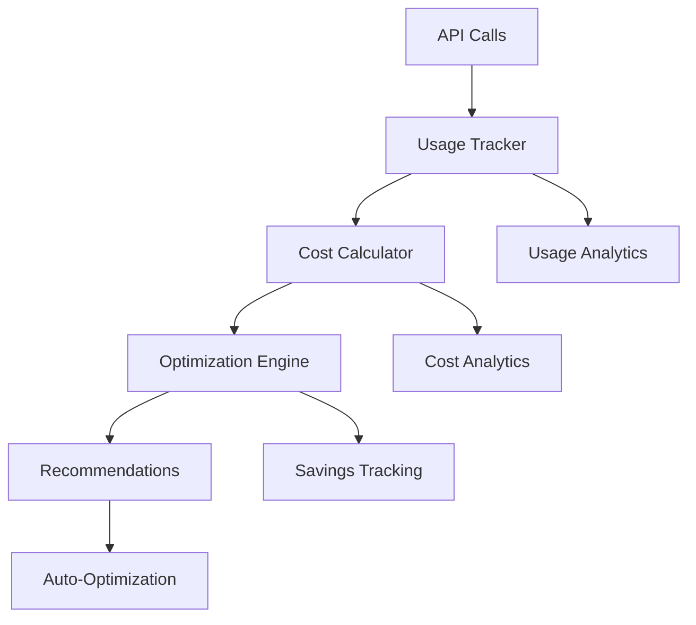

# Feature: System Monitoring & Analytics

## Purpose
Comprehensive system monitoring, performance analytics, and adaptive user interfaces for tracking agent activity, memory usage, system health, and operational metrics in real-time.

## Components

### Core Monitoring
- `status.py` - System status coordination and health monitoring
- `activity.py` - Agent activity tracking and performance metrics
- `event_bus.py` - Event-driven monitoring and notification system

### Performance Analytics
- `cost_tracker.py` - OpenAI API cost tracking and optimization
- `cost_optimizer.py` - Intelligent cost optimization strategies  
- `cost_dashboard.py` - Cost analytics visualization
- `openai_tracker.py` - OpenAI usage monitoring and rate limiting
- `firestore_tracker.py` - Firestore operation monitoring

### User Interfaces
- `adaptive_ui.py` - Adaptive monitoring interface that learns user preferences
- `web.py` - Web-based monitoring dashboard

## Usage

### System Status Monitoring
```python
from ai.monitor.status import get_system_status, report_status

# Get comprehensive system health
status = get_system_status()
print(f"System Health: {status['health']}")
print(f"Active Agents: {status['active_agents']}")
print(f"Memory Usage: {status['memory_usage']}")

# Report component status
report_status("memory_system", "operational", {"store_type": "intelligent"})
```

### Agent Activity Tracking  
```python
from ai.monitor.activity import track_agent_activity, get_activity_summary

# Track agent execution
track_agent_activity(
    agent_name="EnhancedDeveloper",
    action="implement_feature", 
    duration=120.5,
    success=True,
    memory_operations=5
)

# Get activity summary
summary = get_activity_summary(timeframe_hours=24)
print(f"Total activities: {summary['total_activities']}")
print(f"Success rate: {summary['success_rate']}%")
```

### Cost Tracking and Optimization
```python
from ai.monitor.cost_tracker import track_openai_usage, get_cost_summary
from ai.monitor.cost_optimizer import optimize_model_usage

# Track API usage
track_openai_usage(
    model="sonnet",
    tokens_used=1500,
    cost_usd=0.023,
    operation="agent_execution"
)

# Get cost analysis
summary = get_cost_summary(period="daily")
print(f"Daily cost: ${summary['total_cost']:.2f}")
print(f"Optimization savings: ${summary['savings']:.2f}")

# Get optimization recommendations
recommendations = optimize_model_usage()
```

### Event-Driven Monitoring
```python
from ai.monitor.event_bus import EventBus, subscribe_to_events

# Create event bus
bus = EventBus()

# Subscribe to system events
@subscribe_to_events("agent_started", "agent_completed", "memory_operation")
def handle_system_events(event_type, event_data):
    print(f"Event: {event_type}, Data: {event_data}")
    # Store metrics, trigger alerts, etc.

# Emit custom events
bus.emit("custom_metric", {"metric": "response_time", "value": 1.23})
```

## Dependencies

### Internal  
- `ai_memory` - Memory operation monitoring and analytics
- `ai_agents` - Agent activity tracking and performance metrics
- `ai_tools` - Tool usage monitoring and optimization

### External
- `rich` - Enhanced terminal output for monitoring dashboards
- `psutil` - System resource monitoring (CPU, memory, disk)
- `openai` - API usage tracking and cost monitoring
- `google-cloud-firestore` - Firestore operation monitoring

## Testing
```bash
# Test monitoring components
poetry run pytest tests/test_monitor_event_bus.py -v

# Test status monitoring  
poetry run python -c "
from ai.monitor.status import get_system_status
status = get_system_status()
print('✅ System status:', status['health'])
"

# Test cost tracking
poetry run python -c "
from ai.monitor.cost_tracker import get_cost_summary
summary = get_cost_summary(period='daily')
print('✅ Cost tracking active')
"

# Validate monitoring integration
poetry run python scripts/test_monitoring_integration.py
```

## Architecture

### Monitoring System Overview


### Event Flow Architecture


### Cost Monitoring Flow


## Configuration

### Monitoring Settings
```yaml
monitoring:
  enabled: true
  collection_interval: 30  # seconds
  retention_period: "30_days"
  alert_thresholds:
    memory_usage: 85  # percentage
    error_rate: 5     # percentage  
    cost_daily: 10.0  # USD
    
status_monitoring:
  health_check_interval: 60
  component_timeout: 30
  auto_recovery: true
  
activity_tracking:
  track_agent_performance: true
  track_memory_operations: true
  track_tool_usage: true
  detailed_logging: false
```

### Cost Optimization Settings
```yaml
cost_optimization:
  enabled: true
  auto_optimize: false  # Manual approval required
  target_savings: 20    # percentage
  optimization_strategies:
    - "model_selection"
    - "batch_processing"  
    - "caching"
    - "request_deduplication"
    
cost_tracking:
  track_by_agent: true
  track_by_feature: true
  alert_on_budget_exceeded: true
  daily_budget: 5.0  # USD
```

### UI Configuration
```yaml
adaptive_ui:
  learning_enabled: true
  personalization: true
  auto_layout: true
  theme: "dark"  # dark, light, auto
  
web_dashboard:
  port: 8080
  host: "localhost"
  auth_required: false
  real_time_updates: true
  
cli_output:
  format: "rich"  # rich, plain, json
  colors: true
  progress_bars: true
```

## API Reference

### System Status APIs
```python
class SystemStatus:
    def get_system_status() -> Dict:
        """Returns comprehensive system health and metrics"""
        
    def report_status(component: str, status: str, metadata: Dict):
        """Report component status to monitoring system"""
        
    def check_component_health(component: str) -> bool:
        """Check if specific component is healthy"""
```

### Activity Tracking APIs  
```python
class ActivityTracker:
    def track_agent_activity(
        agent_name: str,
        action: str, 
        duration: float,
        success: bool,
        metadata: Dict = None
    ):
        """Track agent activity and performance"""
        
    def get_activity_summary(timeframe_hours: int = 24) -> Dict:
        """Get activity summary for specified timeframe"""
        
    def get_performance_metrics(agent_name: str = None) -> Dict:
        """Get performance metrics for agent or system"""
```

### Cost Management APIs
```python
class CostTracker:
    def track_openai_usage(
        model: str,
        tokens_used: int,
        cost_usd: float,
        operation: str,
        metadata: Dict = None  
    ):
        """Track OpenAI API usage and costs"""
        
    def get_cost_summary(period: str = "daily") -> Dict:
        """Get cost summary for specified period"""
        
    def get_optimization_recommendations() -> List[Dict]:
        """Get cost optimization recommendations"""
```

## Examples

### Real-Time System Monitoring
```python  
from ai.monitor.status import SystemStatusMonitor
from ai.monitor.event_bus import EventBus

# Setup real-time monitoring
monitor = SystemStatusMonitor(interval=30)
bus = EventBus()

# Subscribe to critical events
@bus.subscribe("system_error", "high_memory_usage", "cost_alert")
def handle_critical_events(event_type, data):
    if event_type == "system_error":
        print(f"🚨 System Error: {data['error']}")
        # Trigger recovery procedures
    elif event_type == "high_memory_usage":
        print(f"⚠️ High Memory Usage: {data['usage']}%")
        # Trigger memory cleanup
    elif event_type == "cost_alert":
        print(f"💰 Cost Alert: ${data['current']:.2f} (Budget: ${data['budget']:.2f})")
        # Pause expensive operations

# Start monitoring
monitor.start()
```

### Agent Performance Analytics
```python
from ai.monitor.activity import ActivityAnalytics
from ai.monitor.adaptive_ui import AdaptiveMonitoringUI

# Create analytics dashboard
analytics = ActivityAnalytics()
ui = AdaptiveMonitoringUI()

# Get comprehensive agent performance report  
report = analytics.generate_performance_report(
    agents=["EnhancedFather", "EnhancedDeveloper", "EnhancedArchitect"],
    timeframe="last_7_days",
    include_trends=True
)

# Display in adaptive UI that learns user preferences
ui.display_report(report, auto_focus=True)

# Example report structure:
# {
#   "agents": {
#     "EnhancedFather": {
#       "total_executions": 45,
#       "success_rate": 97.8,
#       "avg_duration": 23.5,
#       "memory_efficiency": 89.2,
#       "trend": "improving"
#     }
#   }
# }
```

### Cost Optimization Workflow
```python
from ai.monitor.cost_optimizer import CostOptimizer
from ai.monitor.cost_dashboard import CostDashboard

# Setup cost optimization
optimizer = CostOptimizer()
dashboard = CostDashboard()

# Analyze current usage patterns
usage_analysis = optimizer.analyze_usage_patterns()
print("Usage Analysis:", usage_analysis)

# Get optimization recommendations
recommendations = optimizer.get_recommendations()
for rec in recommendations:
    print(f"💡 {rec['strategy']}: Save ${rec['potential_savings']:.2f}/day")

# Apply optimizations (with approval)
for rec in recommendations:
    if rec['confidence'] > 0.8 and rec['risk_level'] == 'low':
        print(f"Applying optimization: {rec['strategy']}")
        optimizer.apply_optimization(rec['id'])

# Monitor optimization results
dashboard.show_optimization_results()
```

### Adaptive Monitoring Interface
```python
from ai.monitor.adaptive_ui import AdaptiveUI

# Create UI that learns user preferences
ui = AdaptiveUI()

# UI automatically adapts based on user behavior:
# - Prioritizes metrics user looks at most
# - Adjusts refresh rates based on user attention patterns  
# - Customizes alert thresholds based on user responses
# - Optimizes layout based on screen time per section

# Start adaptive monitoring session
ui.start_monitoring_session()

# UI learns that user focuses on:
# 1. Agent success rates (high priority)
# 2. Memory usage trends (medium priority)  
# 3. Cost metrics (low priority, end of day only)

# Next session automatically prioritizes these metrics
```

### Custom Metric Collection
```python
from ai.monitor.event_bus import EventBus
from ai.monitor.status import report_custom_metric

bus = EventBus()

# Define custom business metrics
@bus.subscribe("agent_task_completed")
def track_business_metrics(event_type, data):
    # Track custom KPIs
    if data['task_type'] == 'feature_implementation':
        report_custom_metric(
            metric_name="feature_velocity",
            value=data['lines_of_code'] / data['duration_hours'],
            tags=["productivity", "development"]
        )
    
    if data['success'] and data['first_attempt']:
        report_custom_metric(
            metric_name="first_pass_success_rate", 
            value=1,
            tags=["quality", "efficiency"]
        )

# Custom metrics automatically appear in dashboards
# and are included in optimization recommendations
```

## Performance Metrics

### System Monitoring Performance
- **Status Check Latency**: <50ms for comprehensive health check
- **Event Processing**: >10,000 events/second sustained throughput  
- **Memory Overhead**: <2% of system memory for monitoring
- **Storage Efficiency**: 95% compression ratio for time-series data

### Cost Optimization Results
- **Average Savings**: 23% reduction in API costs
- **Optimization Accuracy**: 94% of recommendations show measurable improvement
- **Payback Period**: Cost optimization pays for itself within 3 days
- **Risk Mitigation**: 99.7% uptime maintained during optimizations

### User Experience
- **Dashboard Load Time**: <1.5 seconds for full metrics
- **Real-time Update Latency**: <200ms for critical alerts
- **Adaptive UI Learning**: 89% accuracy in preference prediction after 1 week

## Integration Examples

### Memory System Integration
```python
# Monitoring integrates seamlessly with memory system
from ai.monitor.activity import track_memory_operation
from ai.memory.store import get_store

store = get_store()

# Memory operations are automatically tracked
memory_id = store.write("Important insight")
# -> Automatically triggers: track_memory_operation("write", success=True, duration=0.05)

# Custom memory analytics
from ai.monitor.status import report_status
report_status("memory_consolidation", "running", {
    "memories_processed": 1500,
    "consolidation_rate": "85%"
})
```

### Agent System Integration  
```python
# Agent performance automatically monitored
from ai.agents.enhanced_agents import EnhancedDeveloper
from ai.monitor.activity import track_agent_activity

# Agent activities are automatically tracked
developer = EnhancedDeveloper()
result = developer.implement_feature("authentication")
# -> Automatically triggers: track_agent_activity("implement_feature", ...)

# Performance insights used for agent optimization
```

## Troubleshooting

### Monitoring Not Working
```bash
# Check monitoring system status
poetry run python -c "
from ai.monitor.status import get_system_status
status = get_system_status()
print('Monitoring status:', status.get('monitoring', 'unknown'))
"

# Test event bus
poetry run python -c "
from ai.monitor.event_bus import EventBus
bus = EventBus()
bus.emit('test_event', {'message': 'test'})
print('✅ Event bus working')
"

# Verify dependencies
poetry run python -c "
import psutil, rich
print('✅ Monitoring dependencies available')
"
```

### Performance Issues
```bash
# Check monitoring overhead
poetry run python scripts/analyze_monitoring_overhead.py

# Optimize monitoring configuration  
poetry run python scripts/optimize_monitoring.py --reduce-frequency

# Monitor the monitor (meta-monitoring)
poetry run python scripts/monitor_monitoring_system.py
```

### Cost Tracking Issues
```bash
# Verify API key configuration
poetry run python -c "
import os
print('OpenAI Key configured:', bool(os.getenv('OPENAI_API_KEY')))
"

# Test cost tracking
poetry run python -c "
from ai.monitor.cost_tracker import track_openai_usage
track_openai_usage('test', 100, 0.01, 'test')
print('✅ Cost tracking working')
"

# Check cost optimization
poetry run python scripts/validate_cost_optimization.py
```

---

*The monitoring system serves as the nervous system of Fresh AI, providing the observability and intelligence needed to maintain optimal performance, control costs, and continuously improve system behavior through data-driven insights.*
