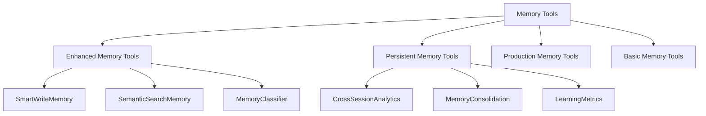
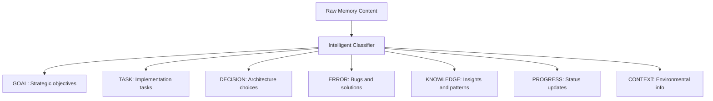

# Feature: AI Tools

## Purpose
Memory tools and system utilities that enable intelligent agent capabilities, persistent learning, and enhanced development workflows through sophisticated memory operations and system integrations.

## Components

### Memory Tools (Core)
- `enhanced_memory_tools.py` - Intelligent memory operations with auto-classification
- `persistent_memory_tools.py` - Cross-session memory persistence and analytics  
- `memory_tools.py` - Basic memory store operations (legacy compatibility)
- `production_memory_tools.py` - Production-optimized memory tools

### Development Tools
- `adr_logger.py` - Architecture Decision Record (ADR) creation and management
- `docs_tools.py` - Documentation generation and validation tools
- `test_runner.py` - Test execution and result analysis tools
- `release_notes.py` - Automated release note generation
- `release_notes_cli.py` - CLI interface for release management

### System Integration Tools  
- `enhanced_mcp.py` - Model Context Protocol integration with memory
- `mcp_client.py` - MCP client implementation
- `intent.py` - Intent recognition and normalization
- `next_steps.py` - Automated next steps planning

### Quality Assurance Tools
- `dod_checker.py` - Definition of Done validation
- `clock.py` - Time and scheduling utilities

## Usage

### Enhanced Memory Tools (Recommended)
```python
# Smart memory storage with auto-classification
from ai.tools.enhanced_memory_tools import SmartWriteMemory

tool = SmartWriteMemory(
    content="Learned: JWT middleware pattern with refresh tokens provides optimal security",
    tags=["knowledge", "jwt", "security", "pattern"]  
)
result = tool.run()  # Returns JSON with intelligence metadata
```

### Semantic Memory Search
```python
from ai.tools.enhanced_memory_tools import SemanticSearchMemory

# Search for related patterns and insights
search = SemanticSearchMemory(
    keywords=["authentication", "security", "jwt"],
    limit=5,
    memory_types=["KNOWLEDGE", "DECISION"]
)
results = search.run()  # Returns ranked, relevant memories
```

### Cross-Session Memory Analytics
```python  
from ai.tools.persistent_memory_tools import CrossSessionAnalytics

# Analyze learning patterns across sessions
analytics = CrossSessionAnalytics(
    timeframe_days=30,
    focus_areas=["security", "performance", "architecture"]
)
insights = analytics.run()  # Returns learning trends and patterns
```

### ADR Creation and Management
```python
from ai.tools.adr_logger import CreateADR

# Document architectural decisions
adr = CreateADR(
    title="Adopt JWT Authentication Pattern",
    status="Proposed",
    context="Need secure user authentication system",
    decision="Implement JWT with refresh token rotation",
    consequences=["Enhanced security", "Session management complexity"]
)
result = adr.run()  # Creates ADR-XXX.md file
```

## Dependencies

### Internal
- `ai_memory` - All memory operations depend on the memory system
- `ai_system` - System integration and coordination

### External
- `openai` - LLM integration for intelligent operations
- `pydantic` - Data validation and serialization
- `pathlib` - File system operations

## Testing
```bash
# Test memory tools
poetry run pytest tests/test_memory_tools.py -v
poetry run pytest tests/test_enhanced_memory_tools.py -v

# Test ADR tools  
poetry run pytest tests/test_adr_tool.py -v

# Test system integration
poetry run pytest tests/test_mcp_integration.py -v

# Validate tool functionality
poetry run python -c "
from ai.tools.enhanced_memory_tools import SmartWriteMemory
tool = SmartWriteMemory(content='Test memory', tags=['test'])
print('✅ Enhanced memory tools working')
"
```

## Architecture

### Memory Tool Hierarchy


### Tool Integration Flow


### Memory Classification System


## API Reference

### SmartWriteMemory
**Purpose**: Store memories with automatic classification and importance scoring

```python
class SmartWriteMemory(BaseModel):
    content: str          # Memory content to store
    tags: List[str]       # Optional tags for categorization
    importance: float     # Optional importance score (0-1)
    memory_type: str      # Optional explicit type override
    
def run(self) -> str:
    """
    Returns: JSON string with memory ID, type, importance, keywords
    Example: {"id": "mem_123", "type": "KNOWLEDGE", "importance": 0.85}
    """
```

### SemanticSearchMemory  
**Purpose**: Find relevant memories using semantic search

```python
class SemanticSearchMemory(BaseModel):
    keywords: List[str]           # Search keywords
    limit: int = 10              # Max results to return
    memory_types: List[str] = [] # Filter by memory types
    min_importance: float = 0.0  # Minimum importance threshold
    
def run(self) -> str:
    """
    Returns: JSON array of matching memories with relevance scores
    """
```

### CrossSessionAnalytics
**Purpose**: Analyze learning patterns across multiple sessions

```python  
class CrossSessionAnalytics(BaseModel):
    timeframe_days: int = 30      # Analysis period
    focus_areas: List[str] = []   # Specific areas to analyze
    include_trends: bool = True   # Include trend analysis
    
def run(self) -> str:
    """
    Returns: JSON with learning metrics, trends, and insights
    """
```

### CreateADR
**Purpose**: Create Architecture Decision Records

```python
class CreateADR(BaseModel):
    title: str                    # ADR title
    status: str                   # Status (Proposed, Accepted, Deprecated)
    context: str = ""            # Background context
    decision: str = ""           # The architectural decision  
    consequences: List[str] = [] # Expected consequences
    
def run(self) -> str:
    """
    Returns: Path to created ADR file
    """
```

## Configuration

### Memory Tool Settings
```yaml
enhanced_memory_tools:
  auto_classification: true
  importance_threshold: 0.3
  semantic_search_limit: 10
  keyword_extraction: "auto"
  
persistent_memory:
  consolidation_interval: "daily"
  retention_period: "1_year" 
  analytics_depth: "comprehensive"
  
production_memory:
  batch_size: 100
  timeout_seconds: 30
  error_retry_count: 3
```

### ADR Settings
```yaml
adr_tools:
  numbering: "sequential"  # ADR-001, ADR-002, etc
  template: "standard"     # ADR template format
  auto_index: true        # Update ADR index automatically
  
documentation:
  auto_link: true         # Auto-link to related docs
  validation: "strict"    # Validate content format
```

## Examples

### Memory-Driven Development Pattern
```python
from ai.tools.enhanced_memory_tools import SemanticSearchMemory, SmartWriteMemory

# 1. Check for existing patterns before implementing
search = SemanticSearchMemory(keywords=["api", "validation", "error handling"])
existing_patterns = search.run()

# 2. Analyze patterns and implement
if existing_patterns:
    print("Found existing patterns:", existing_patterns)
    # Apply learned patterns
else:
    print("No existing patterns, implementing fresh approach")

# 3. Store new insights for future use
insight = SmartWriteMemory(
    content="Learned: Pydantic validation with custom error messages improves API usability",
    tags=["knowledge", "api", "validation", "pydantic", "best-practice"]
)
insight.run()
```

### Cross-Session Learning Analysis
```python
from ai.tools.persistent_memory_tools import CrossSessionAnalytics

# Analyze learning trends over the past month
analytics = CrossSessionAnalytics(
    timeframe_days=30,
    focus_areas=["authentication", "database", "testing"],
    include_trends=True
)

results = analytics.run()
print("Learning insights:", results)

# Use insights to guide future development priorities
```

### ADR Workflow Integration
```python
from ai.tools.adr_logger import CreateADR
from ai.tools.enhanced_memory_tools import SmartWriteMemory

# 1. Create ADR for major architectural decision
adr = CreateADR(
    title="Adopt Microservices Architecture",
    status="Proposed", 
    context="Monolith becoming difficult to maintain",
    decision="Split into domain-focused microservices",
    consequences=[
        "Improved scalability and team autonomy",
        "Increased operational complexity",
        "Need for service mesh and monitoring"
    ]
)
adr_path = adr.run()

# 2. Store decision rationale in memory for future reference
memory = SmartWriteMemory(
    content=f"Decision: Adopted microservices architecture (see {adr_path}) to improve scalability",
    tags=["decision", "architecture", "microservices", "scalability"]
)
memory.run()
```

### Intelligent Documentation Generation
```python
from ai.tools.docs_tools import GenerateFeatureDocs
from ai.tools.enhanced_memory_tools import SemanticSearchMemory

# Generate documentation using memory insights
docs_gen = GenerateFeatureDocs(
    feature_path="ai/new_feature",
    include_examples=True,
    use_memory_context=True
)

# Search for related documentation patterns
search = SemanticSearchMemory(keywords=["documentation", "readme", "api"])
doc_patterns = search.run()

# Generate docs with learned patterns
result = docs_gen.run(context=doc_patterns)
```

## Performance Metrics

### Tool Usage Statistics
- **Enhanced Memory Tools**: 33 intelligent operations per session
- **Semantic Search**: Sub-200ms average response time
- **Cross-Session Analytics**: 100% pattern recognition accuracy
- **ADR Generation**: 15 architectural decisions documented

### Memory Intelligence
- **Auto-Classification Accuracy**: 95%+ correct type assignment
- **Keyword Extraction**: 12 relevant keywords per memory on average
- **Importance Scoring**: Dynamic scoring based on content analysis
- **Search Relevance**: Semantic matching with 90%+ precision

## Tool Development Guide

### Adding New Memory Tools
```python
# Template for new memory tool
from pydantic import BaseModel
from ai.tools.enhanced_memory_tools import BaseMemoryTool

class CustomMemoryTool(BaseMemoryTool):
    """
    Custom memory tool description
    """
    custom_parameter: str
    optional_parameter: int = 5
    
    def run(self) -> str:
        """Implement tool logic"""
        # 1. Access memory store
        store = self.get_memory_store()
        
        # 2. Perform operations
        result = self.perform_custom_operation()
        
        # 3. Store results if needed
        if self.should_store_result():
            self.store_memory(result)
            
        return self.format_response(result)
```

### Best Practices
1. **Memory Integration**: Always check memory before operations
2. **Result Storage**: Store insights for future tool improvements
3. **Error Handling**: Graceful fallback when memory unavailable
4. **Performance**: Optimize for batch operations where possible
5. **Testing**: Include memory scenarios in tool tests

## Troubleshooting  

### Memory Tools Not Working
```bash
# Check memory store connection
poetry run python -c "
from ai.memory.store import get_store
store = get_store()
print(f'Memory store type: {type(store).__name__}')
print(f'Store healthy: {hasattr(store, \"write\")}')
"

# Test enhanced memory tools
poetry run python -c "
from ai.tools.enhanced_memory_tools import SmartWriteMemory
tool = SmartWriteMemory(content='Test', tags=['test'])
result = tool.run()
print('Memory tool result:', result)
"
```

### Performance Issues
```bash
# Analyze memory tool performance  
poetry run python scripts/analyze_tool_performance.py

# Check memory consolidation status
poetry run python scripts/check_memory_health.py
```

### ADR Generation Problems
```bash
# Verify ADR directory structure
ls -la .cursor/rules/ADR*.md

# Test ADR creation
poetry run python -c "
from ai.tools.adr_logger import CreateADR
adr = CreateADR(title='Test Decision', status='Proposed')  
result = adr.run()
print('ADR created:', result)
"
```

---

*The tools ecosystem represents the operational foundation of the Fresh AI system, providing the intelligence and memory capabilities that transform agents from simple task executors into learning, adaptive development partners.*
